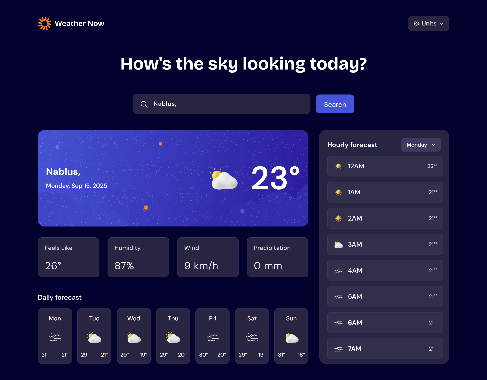
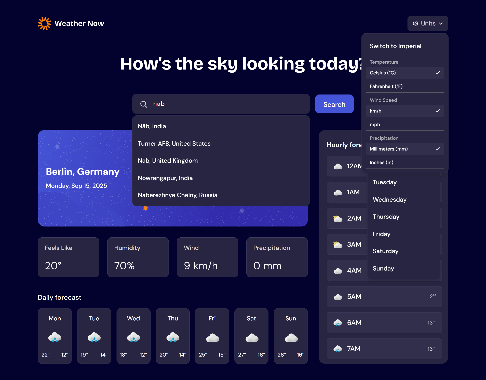
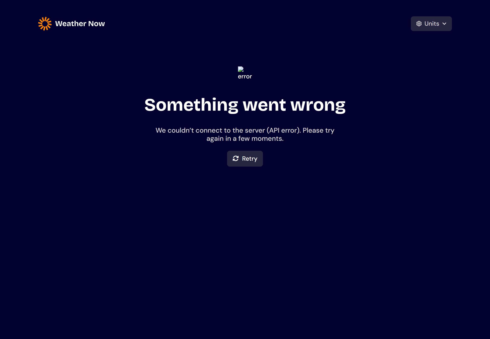
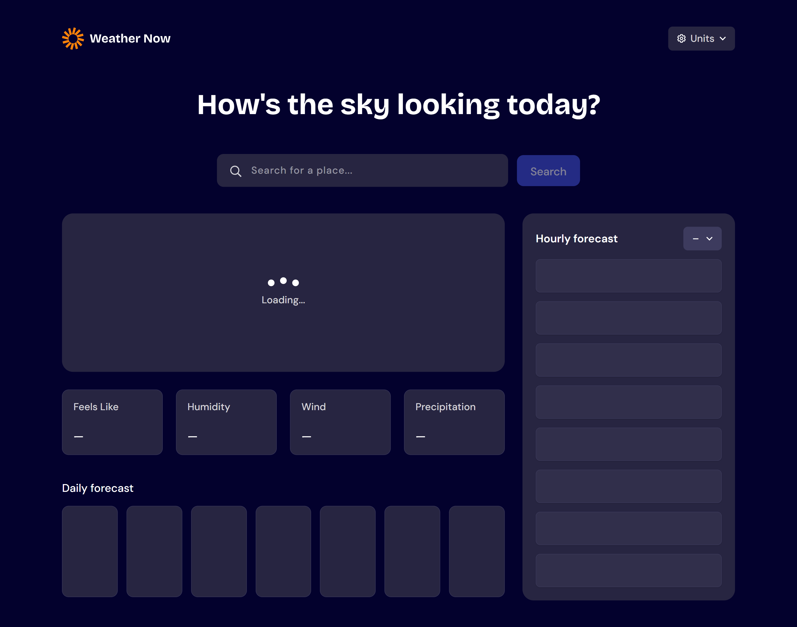

# Frontend Mentor - Weather app solution

This is a solution to the [Weather app challenge on Frontend Mentor](https://www.frontendmentor.io/challenges/weather-app-K1FhddVm49). Frontend Mentor challenges help you improve your coding skills by building realistic projects.

## Table of contents

- [Overview](#overview)
  - [The challenge](#the-challenge)
  - [Screenshot](#screenshot)
  - [Links](#links)
- [My process](#my-process)
  - [Built with](#built-with)
  - [Useful resources](#useful-resources)
- [Author](#author)

## Overview

### The challenge

Users should be able to:

- Search for weather information by entering a location in the search bar
- View current weather conditions including temperature, weather icon, and location details
- See additional weather metrics like "feels like" temperature, humidity percentage, wind speed, and precipitation amounts
- Browse a 7-day weather forecast with daily high/low temperatures and weather icons
- View an hourly forecast showing temperature changes throughout the day
- Switch between different days of the week using the day selector in the hourly forecast section
- Toggle between Imperial and Metric measurement units via the units dropdown
- Switch between specific temperature units (Celsius and Fahrenheit) and measurement units for wind speed (km/h and mph) and precipitation (millimeters) via the units dropdown
- View the optimal layout for the interface depending on their device's screen size
- See hover and focus states for all interactive elements on the page

### Screenshot

- 
- 
- 
- 

### Links

- Solution URL:(https://github.com/samahalaymun/weather-app-fm30hackathon)
- Live Site URL:(https://samahalaymun.github.io/weather-app-fm30hackathon/)

## My process

### Built with

- Semantic HTML5 markup
- [React](https://reactjs.org/) - JS library
- [Redux](https://redux.js.org) - JS library
- [tailwindCSS](https://tailwindcss.com) - utility-first CSS framework
- Flexbox
- CSS Grid
- Mobile-first workflow

### Useful resources

- [tailwind](https://tailwindcss.com) - This helped me for styling.
- [youtube](https://www.youtube.com) - This helped me for solving some problems during development -[chatgpt](https://chatgpt.com/) -This helped me for reviewing my code,شnd other things that helped me develop this project.

## Author

- Frontend Mentor - [@samahalaymun](https://www.frontendmentor.io/profile/samahalaymun)
- Linkedin - [samah abu laymun](https://www.linkedin.com/in/samah-abu-laymun-076414a7/)
